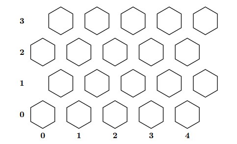

# Movhex: Hexagonal Map Route Optimizer

[](https://gcc.gnu.org/)
[]()
[]()

Movhex is a high-performance route optimization system for a fleet of vehicles navigating a large hexagonal grid. It is designed for efficient computation of travel costs, allowing dynamic modifications to terrain and connectivity. This project was developed for the final exam in Algorithms and Data Structures 2024–2025.

---

## Overview

The program simulates a map made of hexagonal tiles arranged in a rectangular grid. Vehicles can move between adjacent tiles or use one-way air routes (up to 5 per tile) to jump across the map. The movement cost depends on tile-specific exit costs or air route costs, both of which can be modified during execution.

Each tile has:
- A **land cost** (1 to 100, 0 = not traversable)
- Up to 5 **air routes** to any other tile (with individual costs)

The program is designed to process thousands of queries with maximum efficiency.

---

## Visual Representation

Below is a conceptual representation of part of the hexagonal grid layout (4 rows × 5 columns):




Note: Tiles are indexed as `(column, row)`, starting from bottom-left `(0,0)`.

---

## Features

- ✅ Dynamic grid initialization
- ✅ Efficient shortest-path search using **Dial's Algorithm** (bucket queue)
- ✅ Air route toggling with automatic average cost computation
- ✅ Radius-based terrain cost propagation (influences both land and air)
- ✅ Handles unreachable or impassable tiles (exit cost = 0)

---

## Supported Commands

All commands are read from **stdin**, one per line. Each response is printed to **stdout**.

| Command                     | Description |
|----------------------------|-------------|
| `init <cols> <rows>`       | Initializes a new hex map. All tiles have cost = 1, no air routes. |
| `change_cost x y v r`      | Modifies exit and air costs in radius `r` around `(x, y)` using factor `v` ∈ [-10, 10]. |
| `toggle_air_route x1 y1 x2 y2` | Adds/removes a one-way air route from `(x1,y1)` to `(x2,y2)` with computed cost. |
| `travel_cost x1 y1 x2 y2`  | Calculates the minimum cost to reach destination from source. Returns `-1` if unreachable. |

---

## Compilation

You can compile the program with any modern C compiler. Example using `gcc`:

```bash
gcc -Wall -Werror -std=gnu11 -O2 -lm movhex.c -o movhex